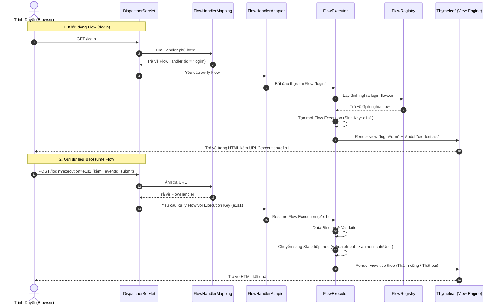
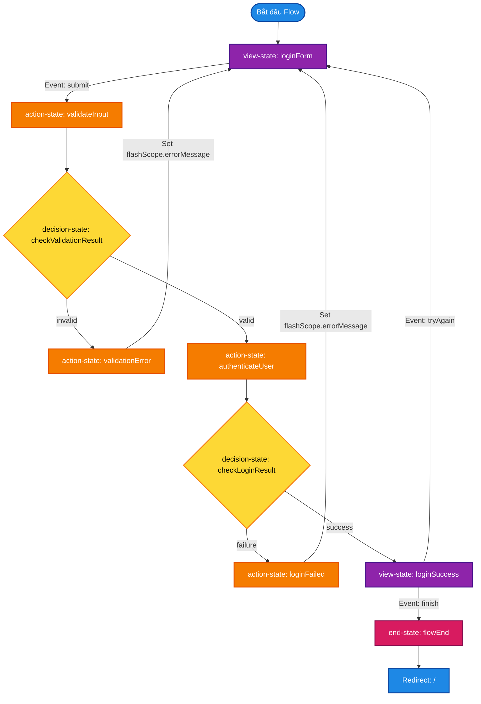

# Hướng Dẫn Chi Tiết Về Spring Web Flow & Kiến Trúc Dự Án

Tài liệu này cung cấp một cái nhìn sâu sắc, toàn diện và trực quan về cấu trúc, cách thức hoạt động và luồng xử lý của ứng dụng **Demo Spring Web Flow** kết hợp với **Spring Boot** và **Thymeleaf**.

---

## 1. Bản Đồ Tổng Quan Kiến Trúc (Architecture Overview)

Dưới đây là mô hình tương tác giữa Client, Spring MVC, Spring Web Flow và Thymeleaf:



---

## 2. Các Khái Niệm Cốt Lõi Trong Spring Web Flow

### 2.1. State (Trạng thái)
Mỗi quy trình (flow) được chia thành nhiều bước nhỏ gọi là các **State**. Có 4 loại State chính được sử dụng trong dự án:

1. **`view-state`**: Hiển thị giao diện người dùng (HTML) và chờ tương tác.
   * *Ví dụ:* `loginForm` hiển thị form đăng nhập, `loginSuccess` hiển thị trang chào mừng.
2. **`action-state`**: Chạy logic Java ẩn (gọi Spring Bean, tính toán dữ liệu).
   * *Ví dụ:* `validateInput` gọi service để validate rỗng, `authenticateUser` thực hiện xác thực tài khoản.
3. **`decision-state`**: Nhánh rẽ điều hướng dựa trên biểu thức logic (if-else).
   * *Ví dụ:* `checkValidationResult` kiểm tra kết quả validate để quyết định đi tiếp hay quay lại form.
4. **`end-state`**: Điểm kết thúc flow. Khi chạm tới đây, toàn bộ dữ liệu trong flow scope sẽ bị hủy.
   * *Ví dụ:* `flowEnd` kết thúc và redirect người dùng về trang chủ `/`.

### 2.2. Scopes (Phạm vi lưu trữ dữ liệu)
Khác với Spring MVC thông thường chỉ có Request và Session, Spring Web Flow cung cấp các Scope tối ưu cho ứng dụng nhiều bước:

| Scope | Vòng đời (Lifecycle) | Ứng dụng trong Demo |
| :--- | :--- | :--- |
| **`requestScope`** | Tồn tại trong duy nhất 1 request. | Lưu trữ dữ liệu tạm thời trong một lần request. |
| **`flashScope`** | Tồn tại trong request hiện tại và tồn tại tiếp ở lần render màn hình tiếp theo (phù hợp khi redirect). | Lưu thông báo lỗi `errorMessage` khi validate thất bại hoặc sai tài khoản để hiển thị lên form. |
| **`viewScope`** | Tồn tại khi người dùng đang ở một `view-state` cụ thể. Bị hủy khi chuyển sang state khác. | Lưu trữ dữ liệu phục vụ riêng cho một màn hình cụ thể. |
| **`flowScope`** | Tồn tại xuyên suốt từ lúc bắt đầu flow cho tới khi kết thúc (`end-state`). | Lưu trữ đối tượng `credentials` (chứa username, password) để dùng qua các bước. |
| **`conversationScope`** | Tồn tại lâu nhất, xuyên suốt tất cả các sub-flow nằm trong cùng một phiên làm việc chính. | Lưu thông tin cấu hình dùng chung giữa nhiều luồng nghiệp vụ. |

---

## 3. Phân Tích Sâu Luồng Đăng Nhập (Login Flow Deep-dive)

Sơ đồ luồng đi của dữ liệu và các state trong `login-flow.xml`:



### Các bước hoạt động chi tiết:
1. **Khởi tạo:** Đối tượng `LoginCredentials` được tạo bằng thẻ `<var>` và đưa vào `flowScope` với tên `credentials`.
2. **Hiển thị Form (`loginForm`):** 
   * Thuộc tính `model="credentials"` liên kết form nhập liệu với đối tượng trong Java.
   * Thẻ `<binder>` định nghĩa rõ chỉ nhận dữ liệu cho hai trường `username` và `password`.
3. **Kiểm tra dữ liệu rỗng (`validateInput`):**
   * Gọi hàm `authenticationService.validateCredentials(credentials)`.
   * Trả về chuỗi `"valid"` hoặc `"invalid"`, lưu kết quả vào `flowScope.validationResult`.
4. **Rẽ nhánh kiểm tra (`checkValidationResult`):**
   * Nếu dữ liệu rỗng (`invalid`), luồng đi tới `validationError` để đặt thông báo lỗi vào `flashScope.errorMessage` rồi quay về `loginForm`.
   * Nếu hợp lệ (`valid`), đi tiếp tới bước xác thực.
5. **Xác thực tài khoản (`authenticateUser`):**
   * Gọi hàm `authenticationService.authenticate(credentials)`.
   * Trả về `true` (nếu đúng admin/123456) hoặc `false`. Kết quả lưu tại `flowScope.loginSuccess`.
6. **Rẽ nhánh xác thực (`checkLoginResult`):**
   * Nếu thất bại, chuyển tới `loginFailed` để nạp lỗi đăng nhập vào `flashScope` rồi quay về form.
   * Nếu thành công, chuyển tới màn hình `loginSuccess`.
7. **Kết thúc:**
   * Tại màn hình thành công, nếu nhấn nút kết thúc (`finish`), flow nhảy tới `flowEnd` và kích hoạt `externalRedirect:/` để quay lại trang chủ.

---

## 4. Tầm Quan Trọng Của Cấu Hình (Configuration Keypoints)

Để Spring Web Flow có thể hoạt động trơn tru trong môi trường Spring Boot và Thymeleaf, hai file cấu hình Java đảm nhận vai trò kết nối:

### 4.1. `WebFlowConfig.java` (Trái tim của Web Flow)
* **`flowRegistry`**: Nạp tất cả các file XML định nghĩa flow trong thư mục `src/main/resources/flows`.
  ```java
  .setBasePath("classpath:flows")
  .addFlowLocationPattern("/**/*-flow.xml")
  ```
  Nhờ cấu hình này, file `flows/login/login-flow.xml` tự động được gán ID là `login` (dựa theo tên thư mục cha).
* **`flowExecutor`**: Bộ máy thực thi chịu trách nhiệm quản lý vòng đời của từng phiên chạy (Flow Execution).
* **`flowHandlerMapping`**: Ánh xạ URL dạng `/login` tới flow có ID tương ứng là `login`. Cấu hình `setOrder(-1)` đảm bảo Web Flow luôn bắt được request trước Spring MVC Controller thông thường.
* **`flowAjaxThymeleafViewResolver`**: Cho phép công cụ Thymeleaf hiểu và render được các trang HTML thuộc về Web Flow.

### 4.2. `WebMvcConfig.java` (Cấu hình Spring MVC)
* File này đăng ký `ViewController` cho trang chủ `/`:
  ```java
  registry.addViewController("/").setViewName("home");
  ```
* Riêng route `/login` **không cần** Controller vì nó đã được `FlowHandlerMapping` xử lý hoàn toàn tự động.

---

## 5. Điểm Khác Biệt Giữa Web Flow & Spring MVC Truyền Thống

| Tính năng | Spring MVC | Spring Web Flow |
| :--- | :--- | :--- |
| **Quản lý trạng thái** | Không trạng thái (Stateless). Phải tự lưu vào HttpSession hoặc DB thủ công. | Có trạng thái (Stateful). Web Flow quản lý trạng thái tự động qua các bước thông qua tham số `execution`. |
| **Cơ chế định hướng** | Do Java Controller quyết định (trả về String view name hoặc redirect). | Định nghĩa rõ ràng bằng sơ đồ XML (`transition on="..." to="..."`). Rất trực quan và dễ quản lý. |
| **Dữ liệu tạm** | Khó quản lý thời gian sống của các đối tượng trung gian giữa nhiều màn hình. | Có các Scope chuyên biệt (`flowScope`, `flashScope`, `viewScope`) tự động dọn dẹp khi kết thúc luồng. |
| **Bảo mật luồng** | Người dùng có thể truy cập trực tiếp vào bước 3 bằng cách nhập URL nếu lập trình viên không check kỹ. | Khóa chặt chẽ. Trình duyệt bắt buộc phải đi đúng thứ tự. Nếu cố tình truy cập sai bước, Web Flow sẽ báo lỗi phiên bản hoặc không tìm thấy trạng thái. |

---

## 6. Hướng Dẫn Phát Triển & Mở Rộng

Khi bạn muốn thêm một luồng nghiệp vụ mới (ví dụ: đăng ký tài khoản `register`):
1. **Tạo thư mục flow mới:** `src/main/resources/flows/register/`
2. **Định nghĩa file XML:** Tạo file `register-flow.xml` bên trong thư mục trên.
3. **Thiết kế các view:** Tạo các file giao diện Thymeleaf tương ứng trong thư mục `src/main/resources/templates/register/` (ví dụ: `step1.html`, `step2.html`, `success.html`).
4. **Tạo model và service:** Tạo Java class để binding dữ liệu (nếu cần) và service xử lý logic.
5. **Truy cập:** Mở trình duyệt và truy cập đường dẫn `/register`, Spring Web Flow sẽ tự động nhận diện và khởi chạy!
