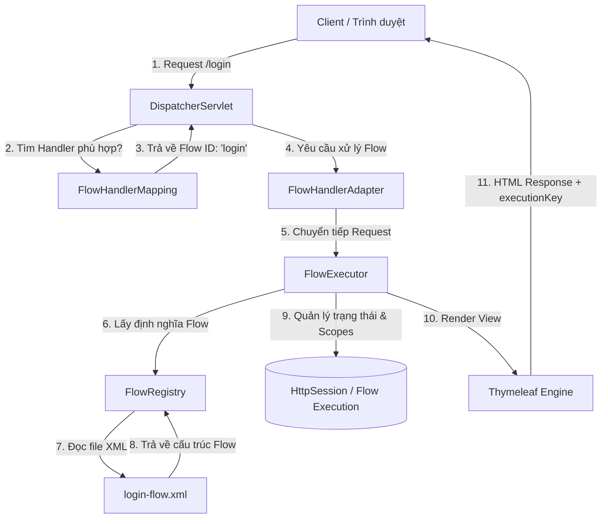
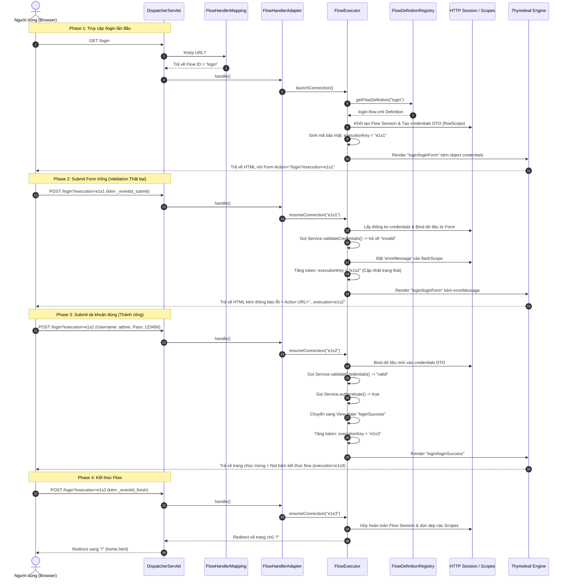

# TÀI LIỆU PHÂN TÍCH VÀ GIẢI THÍCH CHI TIẾT PROJECT SPRING WEB FLOW
> **Dành cho:** Sinh viên CNTT, Kỹ sư phần mềm mới tiếp cận Spring Web Flow, và các Intern cần nắm bắt kiến trúc Enterprise.
> **Vai trò người viết:** Senior Mentor / Technical Architect dẫn dắt và chuyển giao tri thức.

---

## 1. TỔNG QUAN HỆ THỐNG & KIẾN TRÚC CORE

### 1.1. Bài toán thực tế: Sự phức tạp của Quy trình đa bước (Stateful Multi-step Wizards)
Trong các hệ thống Enterprise (Ngân hàng, Đặt vé máy bay, Bảo hiểm, Thương mại điện tử), chúng ta thường gặp bài toán **quy trình nghiệp vụ nhiều bước**:
* **Ví dụ:** Quy trình vay tiền online (Bước 1: Nhập thông tin cá nhân -> Bước 2: Upload tài liệu minh chứng -> Bước 3: Xác nhận OTP -> Bước 4: Ký hợp đồng điện tử).
* **Đặc điểm:** 
  1. Dữ liệu của bước sau phụ thuộc vào bước trước.
  2. Người dùng có thể nhấn nút "Quay lại" (Back) trên trình duyệt hoặc nhấn "Hủy".
  3. Cần lưu trữ dữ liệu tạm thời trong suốt quá trình nhưng phải dọn dẹp sạch sẽ khi hoàn thành hoặc hủy bỏ để tránh rò rỉ bộ nhớ.
  4. Phải ngăn chặn việc "nhảy cóc" (ví dụ: người dùng nhập trực tiếp URL của Bước 3 khi chưa làm Bước 1 và 2).

### 1.2. Spring MVC vs. Spring Web Flow: Cuộc chiến giữa Stateless và Stateful
Để hiểu tại sao **Spring Web Flow (SWF)** tồn tại, hãy so sánh nó với các kiến trúc truyền thống:

| Khía cạnh | Servlet thuần | Spring MVC truyền thống | Spring Web Flow |
| :--- | :--- | :--- | :--- |
| **Trạng thái (State)** | **Stateless.** Lập trình viên tự quản lý qua `HttpSession`. | **Stateless.** Mỗi request là độc lập. Muốn giữ dữ liệu phải dùng `SessionAttributes` hoặc Database. | **Stateful.** Framework tự động quản lý trạng thái của luồng (Flow) thông qua các Scope chuyên biệt. |
| **Quản lý Vòng đời** | Thủ công hoàn toàn. Dễ dẫn đến rò rỉ bộ nhớ session (`Session bloating`). | Khó kiểm soát khi nào dữ liệu trong Session cần được xóa bỏ hoàn toàn. | Tự động hủy toàn bộ dữ liệu tạm thời ngay khi chạm tới trạng thái kết thúc (`end-state`). |
| **Điều hướng (Navigation)** | Dùng code Java: `response.sendRedirect()` hoặc `request.getRequestDispatcher()`. | Do Java Controller quyết định (trả về View name dưới dạng String). | Được định nghĩa tường minh bằng đồ thị trạng thái trong file XML. Trực quan và dễ quản lý. |
| **An toàn luồng (Flow Safety)** | Không có. Người dùng có thể đoán URL và truy cập tùy tiện. | Phải tự viết Filter/Interceptor để kiểm tra trạng thái session trước khi cho phép vào màn hình tiếp theo. | Khóa bảo mật tuyệt đối nhờ tham số `executionKey` (ví dụ `e1s1`). Trình duyệt bắt buộc phải đi đúng trình tự. |

### 1.3. Sơ đồ kiến trúc tổng quan (Request Lifecycle)
Dưới đây là sơ đồ Mermaid mô tả cách một request từ Trình duyệt đi vào ứng dụng Spring Boot và được xử lý bởi Spring Web Flow:



---

## 2. GIẢI PHẪU THƯ MỤC DỰ ÁN (PROJECT DIRECTORY ANATOMY)

Hãy cùng phân tích sơ đồ cây thư mục thực tế của dự án để hiểu cách Spring tổ chức cấu trúc:

```
demo-spring-webflow/
├── org/springframework/webflow/config/
│   └── FlowBuilderServicesBuilder.java  <-- Lớp ghi đè cấu hình (Shadowing class)
├── src/
│   ├── main/
│   │   ├── java/
│   │   │   └── com/example/webflow/
│   │   │       ├── config/
│   │   │       │   ├── WebFlowConfig.java   <-- Động cơ cấu hình Spring Web Flow
│   │   │       │   └── WebMvcConfig.java    <-- Cấu hình bổ trợ Spring MVC
│   │   │       ├── model/
│   │   │       │   └── LoginCredentials.java <-- Form-backing object (Model)
│   │   │       ├── service/
│   │   │       │   └── AuthenticationService.java <-- Xử lý nghiệp vụ (Service)
│   │   │       └── DemoSpringWebFlowApplication.java <-- Điểm chạy chính (Bootstrap)
│   │   └── resources/
│   │       ├── flows/
│   │       │   └── login/
│   │       │       └── login-flow.xml   <-- Sơ đồ máy trạng thái dạng XML
│   │       ├── templates/
│   │       │   ├── login/
│   │       │   │   ├── loginForm.html   <-- Màn hình nhập tài khoản
│   │       │   │   └── loginSuccess.html <-- Màn hình thành công
│   │       │   └── home.html            <-- Trang chủ hệ thống
│   │       └── application.properties       <-- Quản lý biến môi trường
└── pom.xml                                  <-- Khai báo thư viện (Maven POM)
```

### Cơ chế Component Scan và Khởi tạo Bean của Spring Boot:
1. Khi khởi chạy lớp `DemoSpringWebFlowApplication`, annotation `@SpringBootApplication` hoạt động. Nó tự động kích hoạt `@ComponentScan` quét từ package cha `com.example.webflow` xuống tất cả các package con.
2. Spring sẽ tìm các class được đánh dấu bằng các stereotype annotation như `@Configuration` (`WebFlowConfig`, `WebMvcConfig`) và `@Service` (`AuthenticationService`).
3. Spring Container (ApplicationContext) sẽ khởi tạo và quản lý các đối tượng này dưới dạng các **Spring Beans**. Mặc định, tất cả các bean này đều là **Singleton** (chỉ có duy nhất một thực thể tồn tại trong suốt vòng đời ứng dụng).
4. Riêng với Spring Web Flow, nó tự động nạp các file XML nằm trong thư mục `src/main/resources/flows/` dựa trên cấu hình khai báo trong `WebFlowConfig.java`.

---

## 3. PHÂN TÍCH CHI TIẾT TỪNG FILE SOURCE CODE

---

## File 1: `pom.xml`

### Vai trò file
Đây là file cấu hình của **Apache Maven**, dùng để quản lý toàn bộ thư viện liên kết (dependencies), phiên bản Java, các plugin đóng gói, và các thuộc tính cấu hình dự án. Khi Maven build dự án, nó sẽ đọc file này để tải các thư viện từ Maven Central Repository về máy cục bộ.

### Giải thích import/dependency quan trọng
* **`<parent> spring-boot-starter-parent` (version 2.7.18):** Cung cấp các cấu hình mặc định cực kỳ quan trọng cho Spring Boot như phiên bản của các thư viện con, cấu hình compiler Java, cấu hình mã hóa tài nguyên UTF-8.
* **`spring-boot-starter-web`:** Thư viện nền tảng cung cấp toàn bộ hệ sinh thái Spring MVC, hỗ trợ RESTful, và đi kèm một Embedded Servlet Container (mặc định là **Apache Tomcat**) giúp ứng dụng chạy độc lập mà không cần cài đặt Tomcat ngoài.
* **`spring-boot-starter-thymeleaf`:** Tích hợp công cụ hiển thị giao diện **Thymeleaf**. Thymeleaf hoạt động bằng cách phân tích cú pháp HTML tự nhiên (Natural Templates), cho phép thiết kế giao diện tĩnh mở được bằng trình duyệt và render động từ phía server.
* **`spring-webflow` (version 2.5.1.RELEASE):** Thư viện xương sống của dự án. Nó cung cấp toàn bộ các class xử lý flow engine, các thẻ cấu hình XML schema, và các cấu trúc lưu trữ dữ liệu chuyên biệt.

---

## File 2: `DemoSpringWebFlowApplication.java`

### Vai trò file
Lớp khởi động chính (Bootstrap Class) của ứng dụng Spring Boot. Nó chứa phương thức `main` - điểm khởi đầu duy nhất khi chạy chương trình Java.

### Giải thích annotation quan trọng
* **`@SpringBootApplication`:** Đây là một "annotation tổng hợp" (composed annotation), tương đương với việc khai báo ba annotation độc lập sau:
  1. `@SpringBootConfiguration`: Đánh dấu class này là nguồn cấu hình Spring Bean chính.
  2. `@EnableAutoConfiguration`: Chỉ thị cho Spring Boot tự động đoán và cấu hình các Bean cần thiết dựa trên các thư viện khai báo trong `pom.xml`. Ví dụ, thấy `spring-boot-starter-web` thì nó tự động cấu hình Tomcat và Spring MVC.
  3. `@ComponentScan`: Tự động tìm kiếm các component, service, controller trong package hiện tại và các package con.

### Giải thích class
* **Lifecycle:** Lớp này chỉ chạy một lần duy nhất lúc khởi động thông qua lời gọi `SpringApplication.run(...)`. Sau khi Spring ApplicationContext được khởi tạo và chạy thành công, lớp này sẽ chuyển sang trạng thái tĩnh (idle), nhường quyền điều khiển hoàn toàn cho Spring Container.

---

## File 3: `WebMvcConfig.java`

### Vai trò file
Cấu hình bổ sung cho tầng **Spring MVC**. Dùng để xử lý các route (URL) đơn giản không chứa logic nghiệp vụ phức tạp, giúp giảm thiểu việc phải viết các class Controller dư thừa.

### Giải thích import quan trọng
* **`WebMvcConfigurer`:** Một interface cung cấp các callback method để tùy biến cấu hình Spring MVC mà không cần tắt cấu hình tự động mặc định của Spring Boot.
* **`ViewControllerRegistry`:** Lớp hỗ trợ đăng ký nhanh các ánh xạ giữa URL trực tiếp tới View template.

### Giải thích class & phương thức
* **Annotation `@Configuration`:** Đánh dấu lớp này là một lớp cấu hình. Ở runtime, Spring CGLIB sẽ subclass lớp này để đảm bảo cơ chế Singleton cho các Bean được tạo ra.
* **Method `addViewControllers(ViewControllerRegistry registry)`:**
  ```java
  registry.addViewController("/").setViewName("home");
  ```
  * **Giải thích:** Khi người dùng truy cập trang chủ (URL `/`), Spring MVC sẽ lập tức ánh xạ tới view template tên là `home` (tương ứng với file `home.html` trong thư mục templates) mà không cần đi qua bất kỳ Controller nào.

---

## File 4: `WebFlowConfig.java`

### Vai trò file
Đây chính là **"Trái tim"** của hệ thống Web Flow. File này cấu hình toàn bộ hạ tầng chạy của Spring Web Flow và kết nối nó với Spring MVC cũng như Thymeleaf Template Engine.

### Giải thích import quan trọng
* **`AbstractFlowConfiguration`:** Lớp cơ sở cung cấp các phương thức tiện ích (helper methods) giúp khởi tạo nhanh các Builder cho các thành phần cốt lõi của Web Flow.
* **`FlowDefinitionRegistry`:** Nơi lưu trữ và quản lý thông tin đăng ký của toàn bộ các Flow XML trong ứng dụng.
* **`FlowExecutor`:** Bộ máy điều khiển thực thi (Engine) chịu trách nhiệm khởi chạy, duy trì, phục hồi (resume) và kết thúc các Flow.
* **`AjaxThymeleafViewResolver`:** View Resolver đặc biệt hỗ trợ xử lý cả các request Ajax và render template Thymeleaf tích hợp hoàn hảo với trạng thái của Web Flow.

### Giải thích từng biến và Bean khởi tạo
#### Bean: `flowRegistry`
```java
@Bean
public FlowDefinitionRegistry flowRegistry(FlowBuilderServices flowBuilderServices) {
    return getFlowDefinitionRegistryBuilder()
            .setBasePath("classpath:flows")
            .addFlowLocationPattern("/**/*-flow.xml")
            .setFlowBuilderServices(flowBuilderServices)
            .build();
}
```
* **Giải thích:** Định nghĩa nơi tìm kiếm các file XML của flow.
  * `setBasePath("classpath:flows")` chỉ định thư mục gốc là `src/main/resources/flows`.
  * `addFlowLocationPattern("/**/*-flow.xml")` tìm kiếm đệ quy toàn bộ các file kết thúc bằng `-flow.xml`.
  * **Cực kỳ quan trọng:** Thư mục chứa file XML sẽ tự động được lấy làm **Flow ID**. Ví dụ: file `flows/login/login-flow.xml` nằm trong thư mục `login` nên sẽ có Flow ID là `"login"`.

#### Bean: `flowBuilderServices`
```java
@Bean
public FlowBuilderServices flowBuilderServices(AjaxThymeleafViewResolver flowAjaxThymeleafViewResolver) {
    MvcViewFactoryCreator viewFactoryCreator = new MvcViewFactoryCreator();
    viewFactoryCreator.setUseSpringBeanBinding(true);
    viewFactoryCreator.setViewResolvers(Collections.singletonList(flowAjaxThymeleafViewResolver));

    return getFlowBuilderServicesBuilder()
            .setViewFactoryCreator(viewFactoryCreator)
            .setDevelopmentMode(true)
            .build();
}
```
* **Giải thích:** Cung cấp các dịch vụ nền tảng cho việc build flow.
  * `setUseSpringBeanBinding(true)` bật cơ chế bind dữ liệu thông minh của Spring MVC (hỗ trợ chuyển đổi kiểu dữ liệu, format, validate).
  * `setViewResolvers` chỉ định sử dụng Thymeleaf để render giao diện.
  * `setDevelopmentMode(true)` bật chế độ phát triển: Khi bạn thay đổi file XML flow, hệ thống sẽ tự động nạp lại (hot reload) mà không cần restart server.

#### Bean: `flowExecutor`
```java
@Bean
public FlowExecutor flowExecutor(FlowDefinitionRegistry flowRegistry) {
    return getFlowExecutorBuilder(flowRegistry).build();
}
```
* **Giải thích:** Quản lý vòng đời thực thi của flow. Tạo session mới, lưu trữ trạng thái vào HTTP Session, quản lý token bảo mật `executionKey`.

#### Bean: `flowHandlerMapping`
```java
@Bean
public FlowHandlerMapping flowHandlerMapping(FlowDefinitionRegistry flowRegistry) {
    FlowHandlerMapping handlerMapping = new FlowHandlerMapping();
    handlerMapping.setOrder(-1);
    handlerMapping.setFlowRegistry(flowRegistry);
    return handlerMapping;
}
```
* **Giải thích:** Đăng ký bộ ánh xạ URL. Khi request có URL trùng với Flow ID (ví dụ `/login`), mapping này sẽ chặn lại và xử lý.
  * `setOrder(-1)` đảm bảo Web Flow luôn giành quyền xử lý trước các Handler Mapping thông thường của Spring MVC.

#### Bean: `flowHandlerAdapter`
```java
@Bean
public FlowHandlerAdapter flowHandlerAdapter(FlowExecutor flowExecutor) {
    FlowHandlerAdapter handlerAdapter = new FlowHandlerAdapter();
    handlerAdapter.setFlowExecutor(flowExecutor);
    handlerAdapter.setSaveOutputToFlashScopeOnRedirect(true);
    return handlerAdapter;
}
```
* **Giải thích:** Đóng vai trò làm cầu nối (adapter) giúp `DispatcherServlet` của Spring MVC giao tiếp được với `FlowExecutor` của Web Flow.

---

## File 5: `FlowBuilderServicesBuilder.java` (gói `org.springframework.webflow.config`)

### Vai trò file
Đây là một **Shadowing class** (lớp phủ bóng). Nó nằm ở package `org.springframework.webflow.config` ngay trong mã nguồn dự án để ghi đè class gốc có cùng tên trong thư viện jar của Spring Web Flow.

### Tại sao lại viết như vậy? (Runtime Shadowing Trick)
* **Lý do kỹ thuật:** Trong Spring Web Flow phiên bản cũ (2.4 trở về trước), class `FlowBuilderServicesBuilder` bắt buộc phải nhận vào một `ApplicationContext` trong constructor. Kể từ phiên bản 2.5, yêu cầu này đã bị bãi bỏ. 
* Tuy nhiên, để tương thích mượt mà với cấu hình Spring Boot 2.7 không sử dụng cấu hình XML cổ điển, class này được đặt ở đây nhằm:
  1. Loại bỏ các cảnh báo hoặc lỗi không tương thích phiên bản khi khởi chạy bằng Java Configuration (`WebFlowConfig`).
  2. Override phương thức `getExpressionParser()` để mặc định sử dụng `WebFlowSpringELExpressionParser` kết hợp với SpEL (Spring Expression Language), giúp biên dịch mượt mà các biểu thức động trong thẻ XML.

---

## File 6: `LoginCredentials.java`

### Vai trò file
Lớp DTO (Data Transfer Object) đóng vai trò là **Form-Backing Object** (hoặc Model) cho Form đăng nhập. Nó chứa dữ liệu thô do người dùng nhập vào từ màn hình.

### Giải thích import quan trọng
* **`java.io.Serializable`:** Cực kỳ quan trọng! 
  * **Tại sao cần?** Spring Web Flow lưu trữ các biến của `flowScope` trực tiếp vào HTTP Session để duy trì trạng thái qua nhiều request. Để đảm bảo hệ thống có thể lưu trữ (serialize) đối tượng này ra file, truyền qua mạng, hoặc đồng bộ hóa cluster giữa các server, class này bắt buộc phải implement interface `Serializable`.
  * `private static final long serialVersionUID = 1L;` đảm bảo tính nhất quán của class khi giải tuần tự hóa (deserialize).

### Giải thích class & variables
* **Class Lifecycle:** Đối tượng này được khởi tạo động bởi Spring Web Flow khi luồng bắt đầu (qua thẻ `<var name="credentials" .../>`). Nó tồn tại trong suốt vòng đời của flow (`flowScope`) và sẽ bị thu gom rác (garbage collect) ngay khi flow kết thúc.
* **Biến `username` và `password`:** Lưu trữ thông tin đăng nhập của người dùng. Chúng có getter/setter chuẩn để phục vụ cho cơ chế Reflection của Java khi Spring thực hiện binding dữ liệu.

---

## File 7: `AuthenticationService.java`

### Vai trò file
Lớp xử lý nghiệp vụ xác thực tài khoản (Service Layer). Đây là nơi thực hiện các logic tính toán và kiểm tra nghiệp vụ của luồng.

### Giải thích annotation
* **`@Service("authenticationService")`:** Đăng ký class này làm một Service Bean trong Spring IOC Container với tên định danh rõ ràng là `"authenticationService"`. Tên này được dùng để tham chiếu trực tiếp từ file XML cấu hình flow thông qua Expression Language: `#{authenticationService.authenticate(credentials)}`.

### Giải thích phương thức
#### Method: `validateCredentials(LoginCredentials credentials)`
* **Chức năng:** Kiểm tra dữ liệu rỗng.
* **Input:** Đối tượng `LoginCredentials` từ form.
* **Output:** Chuỗi `"valid"` nếu điền đủ, ngược lại trả về `"invalid"`.
* **Phân tích code:** 
  ```java
  if (credentials == null
          || credentials.getUsername() == null
          || credentials.getUsername().trim().isEmpty() ... ) {
      return "invalid";
  }
  ```
  * Service sử dụng phương thức `trim().isEmpty()` để loại bỏ trường hợp người dùng cố tình nhập toàn dấu khoảng trắng nhằm vượt qua kiểm tra rỗng.

#### Method: `authenticate(LoginCredentials credentials)`
* **Chức năng:** Xác thực tài khoản dựa trên dữ liệu demo cứng (Hardcoded credentials: `admin` / `123456`).
* **Output:** Trả về `true` nếu khớp hoàn toàn, ngược lại trả về `false`.

---

## File 8: `application.properties`

### Vai trò file
Lưu trữ các biến cấu hình toàn cục của dự án. 
* `server.port=8081`: Chạy dự án trên cổng `8081` để tránh xung đột với các ứng dụng khác thường chạy ở cổng `8080`.
* `spring.thymeleaf.cache=false`: Tắt bộ nhớ đệm của Thymeleaf. Giúp lập trình viên khi sửa file HTML chỉ cần F5 trình duyệt để thấy kết quả lập tức mà không cần build lại dự án.
* `logging.level.org.springframework.webflow=INFO`: Thiết lập log của Spring Web Flow để dễ dàng theo dõi vòng đời chuyển đổi trạng thái ở terminal console.

---

## File 9: `home.html`

### Vai trò file
Trang chủ tĩnh hiển thị thông tin giới thiệu dự án và cung cấp nút bấm bắt đầu đi vào luồng đăng nhập thông qua liên kết href: `/login`.

---

## File 10: `loginForm.html`

### Vai trò file
Giao diện nhập thông tin đăng nhập (View-state đầu tiên). Tích hợp các thẻ Thymeleaf đặc biệt để binding dữ liệu hai chiều và giao tiếp với Web Flow Engine.

### Giải thích cú pháp Thymeleaf - Web Flow đặc biệt
* **`th:action="${flowExecutionUrl}"`:** 
  * **Giải thích:** Đây là điểm mấu chốt. `flowExecutionUrl` là một biến hệ thống do Web Flow cung cấp. Khi render ra HTML, nó sẽ có dạng `/login?execution=e1s1`. URL này chứa mã phiên chạy hiện tại (`executionKey`), giúp server biết chính xác client này đang ở bước nào trong bộ nhớ.
* **`th:object="${credentials}"`:** Chỉ định đối tượng làm form-backing.
* **`th:field="*{username}"`:** Thực hiện liên kết dữ liệu (Data Binding) tự động cho thuộc tính `username`. Nó sẽ tự tạo ra các thuộc tính `id="username"`, `name="username"`, và điền sẵn giá trị `value` hiện tại của biến vào thẻ input.
* **`name="_eventId_submit"` trên thẻ button:**
  * **Giải thích:** Khi người dùng submit form, Web Flow Engine sẽ đọc tham số request có tiền tố `_eventId_`. Giá trị phía sau (`submit`) chính là tên của **Event** kích hoạt chuyển đổi trạng thái trong XML (`<transition on="submit" .../>`).

---

## File 11: `loginSuccess.html`

### Vai trò file
Trang hiển thị thông báo đăng nhập thành công. Cung cấp giao diện tương tác cuối cùng để người dùng đưa ra quyết định tiếp theo: kết thúc phiên làm việc hiện tại hoặc quay trở lại từ đầu. Giao diện này chứa hai form gửi yêu cầu tương ứng với hai sự kiện (Events) cốt lõi để điều khiển dòng chạy của máy trạng thái Web Flow:

### Phân tích chuyên sâu về cơ chế hoạt động của hai Event:

#### 1. Sự kiện Kết thúc: `_eventId_finish`
* **Cú pháp trong HTML:**
  ```html
  <form th:action="${flowExecutionUrl}" method="post">
      <button type="submit" name="_eventId_finish" class="primary">Kết thúc flow</button>
  </form>
  ```
* **Cơ chế vận hành nội bộ (Internal Mechanics):**
  1. **Tín hiệu gửi đi:** Khi người dùng click vào nút này, trình duyệt sẽ gửi một request POST lên Server với URL là `flowExecutionUrl` (ví dụ: `/login?execution=e1s3`). Nhờ thuộc tính `name="_eventId_finish"`, HTTP request body sẽ mang theo tham số `_eventId_finish`.
  2. **Quy ước tiền tố `_eventId_`:** Đây là quy ước cấu hình bắt buộc của Spring Web Flow. Bất kỳ tham số nào có tiền tố `_eventId_` gửi lên sẽ được `FlowHandlerAdapter` phân tích cú pháp để trích xuất ra tên Event thực tế ở phía sau. Trong trường hợp này, tên Event nhận diện được là **`finish`**.
  3. **Chuyển dịch trạng thái:** Trong file XML `login-flow.xml`, ở trạng thái View State `loginSuccess`, Web Flow Engine tìm thấy cấu hình transition tương ứng:
     ```xml
     <transition on="finish" to="flowEnd"/>
     ```
     Nó lập tức chuyển dịch máy trạng thái tới **`flowEnd`**.
  4. **Giải phóng tài nguyên (Session Clean-up):** Trạng thái `flowEnd` được khai báo là một `<end-state>`:
     ```xml
     <end-state id="flowEnd" view="externalRedirect:/"/>
     ```
     Khi chạm tới `end-state`, Web Flow Engine sẽ thực hiện nhiệm vụ dọn dẹp quan trọng nhất: **Hủy bỏ hoàn toàn Flow Session hiện tại**. Toàn bộ các đối tượng dữ liệu trung gian được lưu trữ trong `flowScope` (bao gồm đối tượng `credentials` chứa username/password) và các scope ngắn hạn khác sẽ bị xóa sạch khỏi HTTP Session. Điều này giúp giải phóng bộ nhớ RAM của server ngay lập tức, ngăn ngừa hoàn toàn lỗi phình to session (`Session Bloating`).
  5. **Điều hướng ngoài (External Redirect):** Cú pháp `externalRedirect:/` chỉ thị cho adapter gửi về trình duyệt mã phản hồi HTTP Redirect (Status 302) để chuyển hướng hoàn toàn trình duyệt về trang chủ `/`. Trình duyệt lúc này thoát ra khỏi luồng Web Flow và bắt đầu một vòng đời MVC thông thường.

#### 2. Sự kiện Quay lại: `_eventId_tryAgain`
* **Cú pháp trong HTML:**
  ```html
  <form th:action="${flowExecutionUrl}" method="post">
      <button type="submit" name="_eventId_tryAgain" class="secondary">Đăng nhập lại</button>
  </form>
  ```
* **Cơ chế vận hành nội bộ (Internal Mechanics):**
  1. **Tín hiệu gửi đi:** Tương tự sự kiện trên, click vào nút này sẽ gửi lên tham số `_eventId_tryAgain`. Spring Web Flow nhận diện được sự kiện tên là **`tryAgain`**.
  2. **Chuyển dịch trạng thái:** Tại View State `loginSuccess`, XML định nghĩa transition:
     ```xml
     <transition on="tryAgain" to="loginForm"/>
     ```
     Nó điều khiển máy trạng thái quay ngược trở lại View State ban đầu là **`loginForm`**.
  3. **Duy trì bộ nhớ (Scope Conservation):** Khác với sự kiện `finish`, sự kiện `tryAgain` **không kết thúc flow**. Do đó, toàn bộ phiên chạy (Flow Session) vẫn tiếp tục được duy trì. Đối tượng `credentials` đang nằm trong `flowScope` **không bị hủy**. Khi người dùng quay trở lại màn hình đăng nhập, các trường dữ liệu trước đó (như username) có thể vẫn được giữ nguyên và hiển thị sẵn trên các ô nhập liệu tùy thuộc vào cách thiết kế template, giúp cải thiện trải nghiệm người dùng (UX) không phải nhập lại từ đầu.
  4. **Cập nhật token bảo mật:** Để đảm bảo tính an toàn cho luồng quay lui này, Flow Executor sẽ tự động tăng mã trạng thái trong URL `executionKey` lên một phiên bản mới (ví dụ từ `e1s3` lên `e1s4`). URL form hành động được cập nhật thành `/login?execution=e1s4`.

---

## 4. PHÂN TÍCH CHI TIẾT FLOW XML CẤU HÌNH (`login-flow.xml`)

File XML này định nghĩa một **Máy trạng thái hữu hạn (Finite State Machine)**. Hãy cùng phân tích từng khối cấu hình của file:

```xml
<flow xmlns="http://www.springframework.org/schema/webflow" ...>
```
* `<flow>` là thẻ căn bản bọc ngoài cùng. Mặc định, trạng thái (State) đầu tiên khai báo bên trong thẻ này sẽ được chọn làm **start-state** (trạng thái bắt đầu chạy) của Flow. Ở đây chính là `loginForm`.

```xml
<var name="credentials" class="com.example.webflow.model.LoginCredentials"/>
```
* **Ý nghĩa:** Khởi tạo một đối tượng kiểu `LoginCredentials` ngay khi bắt đầu luồng. Đối tượng này được lưu vào **`flowScope`** dưới tên biến là `"credentials"`. Nó sẽ sống xuyên suốt cho tới khi luồng kết thúc hoàn toàn.

---

### 4.1. Phân tích chi tiết View State: `loginForm`
```xml
<view-state id="loginForm" view="login/loginForm" model="credentials">
    <binder>
        <binding property="username"/>
        <binding property="password"/>
    </binder>
    <transition on="submit" to="validateInput"/>
</view-state>
```
1. **`id="loginForm"`:** Tên định danh duy nhất của State này.
2. **`view="login/loginForm"`:** Đường dẫn tới file giao diện vật lý. Dưới sự cấu hình của `AjaxThymeleafViewResolver`, Web Flow sẽ tìm file tại `templates/login/loginForm.html`.
3. **`model="credentials"`:** Liên kết trực tiếp trạng thái hiển thị này với đối tượng `credentials` trong bộ nhớ để binding dữ liệu.
4. **Thẻ `<binder>`:** Thiết lập bộ lọc bảo mật dữ liệu đầu vào. Nó chỉ cho phép truyền dữ liệu vào hai thuộc tính được khai báo tường minh là `username` và `password`. Nếu hacker tìm cách chèn thêm các thuộc tính lạ vào request body (Mass Assignment Attack), hệ thống sẽ tự động bỏ qua.
5. **Thẻ `<transition on="submit" to="validateInput"/>`:** 
  * Nếu nhận được event `submit` (người dùng nhấn nút Đăng nhập), hệ thống sẽ lập tức chuyển hướng sang bước tiếp theo là Action State `validateInput`.

---

### 4.2. Phân tích các loại Scopes (Phạm vi lưu trữ dữ liệu)
Spring Web Flow cung cấp 5 loại Scope chuyên biệt với vòng đời và mục đích sử dụng cực kỳ tối ưu:

| Scope | Vòng đời (Lifecycle) | Vùng lưu trữ vật lý | Phép ẩn dụ thực tế (Analogy) | Ứng dụng trong Project |
| :--- | :--- | :--- | :--- | :--- |
| **`requestScope`** | Ngắn nhất. Chỉ tồn tại trong đúng 1 lượt Request-Response. Bị hủy ngay khi phản hồi hoàn tất. | Request Object | **Tấm vé xe buýt:** Chỉ dùng được đúng 1 lượt đi, xuống xe là vé hết giá trị. | Lưu trữ dữ liệu tính toán tạm thời dùng ngay trên màn hình hiện tại. |
| **`flashScope`** | Tồn tại trong request hiện tại và kéo dài thêm qua 1 lần chuyển màn hình (Redirect). Tự động xóa sau đó. | HTTP Session | **Mảnh giấy ghi chú tạm thời:** Đọc xong một lần rồi vứt sọt rác. | Lưu trữ thông báo lỗi `errorMessage` khi validate thất bại để hiển thị lên Form. |
| **`viewScope`** | Tồn tại khi người dùng đang đứng ở một màn hình (`view-state`) cụ thể. Bị hủy ngay khi rời sang State khác. | Flow Execution Context | **Màn hình làm việc cá nhân:** Bạn chỉ dùng tài liệu này khi đang ngồi ở phòng họp này, sang phòng khác là tài liệu bị thu hồi. | Lưu trữ trạng thái tìm kiếm, phân trang của một bảng dữ liệu trên một màn hình cụ thể. |
| **`flowScope`** | Sống xuyên suốt toàn bộ vòng đời của Flow (từ lúc bắt đầu đến khi chạm `end-state`). | HTTP Session | **Chiếc giỏ mua sắm:** Bạn đi từ quầy rau quả sang quầy thịt, đồ trong giỏ vẫn giữ nguyên cho tới khi thanh toán xong. | Lưu trữ đối tượng dữ liệu chung `credentials` để tích lũy qua các bước. |
| **`conversationScope`**| Lâu nhất. Sống xuyên suốt tất cả các sub-flow (luồng con) nằm trong một phiên làm việc chính. | HTTP Session | **Hồ sơ khách hàng chính:** Dùng chung cho toàn bộ các giao dịch liên quan từ đầu đến cuối phiên làm việc tại ngân hàng. | Lưu trữ thông tin đăng nhập của User, cấu hình hệ thống dùng chung giữa nhiều luồng con. |

---

### 4.3. Phân tích các Action State và Decision State còn lại

#### Action State: `validateInput`
```xml
<action-state id="validateInput">
    <evaluate expression="authenticationService.validateCredentials(credentials)"
              result="flowScope.validationResult"/>
    <transition to="checkValidationResult"/>
</action-state>
```
* **`evaluate expression="..."`:** Thực thi biểu thức Java SpEL. Gọi bean `authenticationService`, chạy hàm `validateCredentials` và truyền đối tượng `credentials` vào.
* **`result="flowScope.validationResult"`:** Lấy giá trị trả về (`"valid"` hoặc `"invalid"`) lưu vào biến tạm `validationResult` thuộc `flowScope`.
* Chuyển hướng không điều kiện (`transition to`) sang Decision State `checkValidationResult`.

#### Decision State: `checkValidationResult` (Rẽ nhánh nghiệp vụ)
```xml
<decision-state id="checkValidationResult">
    <if test="'valid'.equals(flowScope.validationResult)"
        then="authenticateUser"
        else="validationError"/>
</decision-state>
```
* **Cơ chế hoạt động:** Đây là khối rẽ nhánh điều kiện (giống cấu trúc `if-else` trong lập trình).
  * Nếu giá trị của biến `validationResult` bằng `"valid"`, luồng đi tiếp tới bước xác thực `authenticateUser`.
  * Ngược lại, chuyển tới Action State `validationError` để chuẩn bị đưa ra cảnh báo lỗi.

#### Action State: `validationError` (Tạo thông báo lỗi)
```xml
<action-state id="validationError">
    <evaluate expression="'Vui lòng nhập đầy đủ username và password.'"
              result="flashScope.errorMessage"/>
    <transition to="loginForm"/>
</action-state>
```
* **Phân tích:** Gán chuỗi thông báo lỗi trực tiếp vào **`flashScope.errorMessage`**. Sau đó thực hiện transition quay trở lại view-state `loginForm`. Nhờ tính chất của `flashScope`, thông báo lỗi này sẽ tồn tại ở lần render tiếp theo của màn hình đăng nhập để hiển thị cho người dùng thấy, và biến mất ngay sau đó.

#### Action State: `authenticateUser` và Decision State: `checkLoginResult`
* Tương tự cơ chế trên, hệ thống gọi dịch vụ xác thực tài khoản. Nếu đúng tài khoản `admin/123456`, hệ thống chuyển hướng người dùng đến màn hình thành công `loginSuccess`. Nếu sai tài khoản, đưa thông báo lỗi `"Sai tên đăng nhập hoặc mật khẩu!"` vào `flashScope` rồi quay lại form.

#### End State: `flowEnd`
```xml
<end-state id="flowEnd" view="externalRedirect:/"/>
```
* **Giải thích:** Khi người dùng ở màn hình thành công và nhấn nút "Kết thúc flow" (`finish`), luồng sẽ chuyển sang trạng thái kết thúc `flowEnd`.
  * Tại đây, Web Flow Engine thực hiện dọn dẹp sạch sẽ toàn bộ dữ liệu trong `flowScope` khỏi HTTP Session.
  * Cú pháp `externalRedirect:/` kích hoạt trình duyệt thực hiện một lệnh redirect hoàn toàn ra ngoài phạm vi quản lý của Flow, quay trở về URL trang chủ `/`.

---

## 5. MÔ PHỎNG VÒNG ĐỜI RUNTIME (RUNTIME LIFECYCLE WALKTHROUGH)

Hãy cùng mô phỏng chi tiết những gì diễn ra bên dưới hệ thống (Spring internals) khi một người dùng thực hiện toàn bộ quy trình đăng nhập:

### Sơ đồ Sequence Diagram của Runtime Lifecycle:



---

## 6. TƯƠNG TÁC CƠ SỞ DỮ LIỆU TRONG SPRING WEB FLOW (DATABASE & HIBERNATE MECHANICS)

Mặc dù dự án demo hiện tại sử dụng cơ chế kiểm tra tài khoản cứng (Hardcoded) để đảm bảo tính đơn giản cho người mới bắt đầu, tuy nhiên trong các hệ thống phần mềm Enterprise thực tế, Web Flow luôn hoạt động song hành cùng **Spring Data JPA** và **Hibernate**. 

Dưới đây là phân tích chuyên sâu về cách tích hợp Database tối ưu trong kiến trúc Web Flow:

### 6.1. Quản lý Persistence Context xuyên suốt Flow (`FlowManagedPersistenceContext`)
* **Thách thức kỹ thuật:** Trong ứng dụng Spring MVC thông thường, mỗi Request được xử lý riêng biệt. Khi Request kết thúc, kết nối Database (EntityManager / Hibernate Session) sẽ lập tức đóng lại.
* **Vấn đề xảy ra:** Nếu bạn có một quy trình đặt hàng 4 bước, ở bước 2 bạn tải một đối tượng `Customer` từ DB lên. Đến bước 4 bạn cần truy cập vào danh sách các đơn hàng của khách hàng này (được khai báo dạng **Lazy Loading** - `@OneToMany(fetch = FetchType.LAZY)`). Hệ thống sẽ lập tức ném ra lỗi kinh điển:
  ```
  org.hibernate.LazyInitializationException: could not initialize proxy - no Session
  ```
* **Giải pháp của Spring Web Flow:** SWF cung cấp cấu hình **`FlowManagedPersistenceContext`**. Khi được kích hoạt, Web Flow sẽ giữ cho `EntityManager` luôn ở trạng thái mở và gắn liền với vòng đời của Flow (Flow Scope). 
* **Cơ chế hoạt động:**
  1. Khi Flow bắt đầu: Một Persistence Context (Hibernate Session) mới được khởi tạo và liên kết chặt chẽ với Flow Session.
  2. Xuyên suốt các bước: Toàn bộ các đối tượng Entity được tải lên từ Database sẽ luôn ở trạng thái **Persistent** (Managed). Bạn có thể thoải mái gọi Lazy Loading ở bất kỳ bước nào mà không sợ lỗi Session.
  3. Khi Flow kết thúc (đạt `end-state`): Web Flow sẽ tự động thực hiện lệnh commit/flush dữ liệu xuống DB và đóng EntityManager lại một cách an toàn.

### 6.2. Phân định ranh giới Transaction (Transactional Boundaries)
Trong Spring Web Flow, các hành động nghiệp vụ (Action) và việc chuyển đổi trạng thái (Transition) được ánh xạ trực tiếp tới các Transaction:
* Bạn nên khai báo các `@Service` có annotation `@Transactional` của Spring để xử lý các nghiệp vụ ghi dữ liệu (Save, Update, Delete).
* Tránh mở transaction trực tiếp từ file XML cấu hình flow. Thay vào đó, hãy để tầng Service Java đảm nhận.
* Cấu trúc Cascade (`CascadeType.ALL`) cần được cấu hình cẩn thận trên các Entity quan hệ `@OneToMany` hoặc `@ManyToOne` để khi đối tượng cha trong `flowScope` được lưu ở bước cuối cùng, toàn bộ các đối tượng con tích lũy qua các bước trước đó sẽ được tự động cascade ghi xuống database trong cùng một Transaction duy nhất.

---

## 7. CƠ CHẾ BẢO MẬT VÀ VALIDATION (SECURITY & VALIDATION ARCHITECTURE)

### 7.1. Chống giả mạo URL (URL Tampering Protection)
Trong các ứng dụng web thông thường, nếu hệ thống không được bảo mật kỹ, người dùng có thể gian lận bằng cách gõ trực tiếp URL `/checkout/step3` để bỏ qua bước thanh toán ở `/checkout/step2`.
* **Cơ chế tự vệ của Web Flow:** Khi người dùng truy cập trực tiếp vào `/login`, hệ thống khởi tạo Flow và sinh ra một chuỗi token duy nhất lưu ở session gọi là `executionKey` (ví dụ: `e1s1` - viết tắt của **Execution 1, State 1**).
* Khi submit thành công bước 1, server tăng mã trạng thái lên thành `e1s2`.
* Nếu người dùng cố tình sao chép URL `...?execution=e1s2` và gửi cho một người khác, hoặc tự ý thay đổi tham số thành `e1s9`, Web Flow Engine sẽ lập tức kiểm tra với cơ sở dữ liệu session hiện tại. Thấy sự bất thường (Key không tồn tại hoặc sai thứ tự mong đợi), hệ thống sẽ từ chối xử lý và ném ra lỗi bảo mật:
  ```
  org.springframework.webflow.execution.repository.NoSuchFlowExecutionException
  ```

### 7.2. Tích hợp Spring Security (Declarative Security)
Nếu dự án có tích hợp thư viện **Spring Security**, bạn có thể bảo mật cực kỳ mạnh mẽ cho từng State cụ thể ngay trong file XML bằng cách sử dụng thẻ `<secured>`:
```xml
<view-state id="secretStep" view="booking/secret">
    <!-- Chỉ cho phép người dùng có quyền ROLE_ADMIN đi vào bước này -->
    <secured attributes="ROLE_ADMIN" match="any"/>
    <transition on="next" to="nextStep"/>
</view-state>
```
Khi người dùng không có quyền hợp lệ cố tình truy cập vào State này, Web Flow sẽ phối hợp cùng Spring Security chặn lại và ném ra ngoại lệ `AccessDeniedException` để chuyển hướng người dùng tới trang cảnh báo lỗi hoặc trang đăng nhập.

### 7.3. Cơ chế Validation tự động trong Flow
Spring Web Flow cung cấp hai cơ chế validation cực kỳ trực quan và mạnh mẽ:

#### Cách 1: Sử dụng Bean Validation (JSR-380 / Hibernate Validator)
Bạn chỉ cần khai báo các annotation chuẩn trên thuộc tính của DTO Class:
```java
public class LoginCredentials implements Serializable {
    @NotBlank(message = "Username không được để trống!")
    private String username;
    
    @Size(min = 6, message = "Mật khẩu phải chứa ít nhất 6 ký tự!")
    private String password;
}
```
Khi form submit, Web Flow sẽ tự động kiểm tra các ràng buộc này trước khi cho phép kích hoạt các transition tiếp theo. Nếu có lỗi, hệ thống tự động đưa các thông báo lỗi vào `MessageContext` để hiển thị trực tiếp lên giao diện HTML thông qua Thymeleaf.

#### Cách 2: Sử dụng Validation theo tên Convention (Convention-based Validation)
Spring Web Flow hỗ trợ cơ chế tự động tìm kiếm hàm validate dựa trên tên của View State.
* **Quy tắc đặt tên:** Tạo một class Validator hoặc viết trực tiếp một phương thức trong Model/Service theo cú pháp:
  `public void validate[StateId](ValidationContext context)`
* **Áp dụng vào dự án:** Với view-state có `id="loginForm"`, nếu bạn viết một hàm trong lớp `LoginCredentials` như sau:
  ```java
  public void validateLoginForm(ValidationContext context) {
      MessageContext messages = context.getMessageContext();
      if (username == null || username.isEmpty()) {
          messages.addMessage(new MessageBuilder().error()
              .source("username").defaultText("Tên đăng nhập bắt buộc điền.").build());
      }
  }
  ```
  * **Hành vi runtime:** Trước khi thực hiện bất kỳ transition nào thoát khỏi state `loginForm`, Web Flow Engine sẽ dùng Java Reflection tìm và tự động chạy phương thức `validateLoginForm(...)` này. Nếu trong `MessageContext` có chứa bất kỳ thông điệp báo lỗi (Error Message) nào, quá trình chuyển đổi trạng thái sẽ lập tức bị đình chỉ, và người dùng sẽ bị giữ lại màn hình hiện tại kèm theo các thông báo lỗi được hiển thị.

---

## 8. CẨM NĂNG KHẮC PHỤC LỖI THƯỜNG GẶP (TROUBLESHOOTING GUIDE)

Dưới đây là bảng tổng hợp các lỗi kinh điển khi lập trình Spring Web Flow, nguyên nhân sâu xa từ hệ thống và giải pháp khắc phục triệt để:

| Tên Ngoại Lệ (Exception) | Nguyên nhân runtime sâu xa | Cách khắc phục triệt để |
| :--- | :--- | :--- |
| **`NoSuchBeanDefinitionException`** | Spring container tìm kiếm một Bean được tham chiếu trong file XML nhưng không thấy trong bộ nhớ ApplicationContext.<br>*Ví dụ:* Trong XML gọi `authenticationService` nhưng ở class Java quên chưa đánh dấu `@Service`. | 1. Kiểm tra xem class Java đã có annotation `@Service("tên_bean")` hoặc `@Component` chưa.<br>2. Đảm bảo package chứa class nằm trong vùng quét của `@ComponentScan`. |
| **`BadlyFormattedFlowExecutionKeyException`** | Người dùng hoặc Hacker cố tình chỉnh sửa tham số `execution` trên URL thành giá trị không hợp lệ (ví dụ: `?execution=xyz` hoặc `?execution=e1s99`). | Hệ thống sẽ báo lỗi HTTP 500 hoặc 400. Cần cấu hình một lớp `@ControllerAdvice` để bắt ngoại lệ này và thực hiện redirect người dùng về trang bắt đầu flow (`/login`) một cách lịch sự. |
| **`NoSuchFlowExecutionException`** | Phiên làm việc của Flow (Flow Session) đã hết hạn (Timeout) hoặc đã bị hủy bỏ trước đó, nhưng người dùng vẫn cố nhấn nút "Back" trên trình duyệt để thao tác tiếp. | Sử dụng thẻ `<global-transitions>` trong XML để định nghĩa cơ chế tự động bắt ngoại lệ này và đưa người dùng quay lại màn hình bắt đầu của quy trình. |
| **`ViewState` not found / Resolver Error** | Web Flow tìm kiếm file HTML vật lý dựa trên khai báo của thẻ `<view-state view="...">` nhưng không thấy file tồn tại. | 1. Kiểm tra lại đường dẫn file vật lý trong thư mục `src/main/resources/templates/`.<br>2. Hãy nhớ rằng Thymeleaf phân biệt chữ hoa chữ thường (Case-sensitive) trên các hệ điều hành Linux/Unix khi deploy thực tế. |
| **`LazyInitializationException`** | Bạn cố gắng truy cập vào một quan hệ được cấu hình Lazy Loading từ một Entity sau khi Hibernate Session đã bị đóng. | 1. Kích hoạt tính năng `FlowManagedPersistenceContext` trong cấu hình flow registry của dự án.<br>2. Hoặc sử dụng cấu hình truy vấn JPA `JOIN FETCH` để nạp sẵn dữ liệu cần thiết trước khi thoát khỏi tầng Service. |
| **`Circular dependency`** | Lỗi vòng lặp vô hạn khi khởi tạo Bean. Bean A yêu cầu tiêm (inject) Bean B, trong khi Bean B cũng đang yêu cầu tiêm Bean A. | 1. Thiết kế lại cấu trúc dự án để tách các phần phụ thuộc chéo.<br>2. Sử dụng annotation `@Lazy` tại điểm tiêm dependency để trì hoãn việc khởi tạo bean cho đến khi thực sự cần dùng. |

---

## 9. ĐÁNH GIÁ VÀ TỔNG KẾT KIẾN TRÚC

### 9.1. Ưu điểm vượt trội của Spring Web Flow
1. **Quản lý trạng thái tự động và an toàn:** Giải quyết triệt để vấn đề session bloating bằng cách tự động dọn dẹp các scope trung gian ngay khi luồng kết thúc.
2. **Tách biệt hoàn toàn luồng điều hướng khỏi mã nguồn Java:** Mọi đường đi, nước bước của quy trình được biểu diễn tường minh trong file XML, giúp các nhà quản lý dự án hoặc các lập trình viên mới dễ dàng nắm bắt nghiệp vụ mà không cần đọc hàng ngàn dòng code Java controller.
3. **Bảo mật tuyệt đối mặc định:** Tham số `execution` ngăn chặn hoàn toàn các cuộc tấn công nhảy cóc màn hình hoặc hack tham số URL.

### 9.2. Nhược điểm và hạn chế
1. **Khó khăn khi Debug:** Do luồng đi được cấu hình bằng XML và Expression Language, việc đặt các breakpoint để debug dòng code chạy qua lại giữa XML và Java Service phức tạp hơn nhiều so với Spring MVC thông thường.
2. **Cú pháp XML cồng kềnh:** Trong kỷ nguyên lập trình hiện đại hướng tới cấu hình bằng Annotation và Java Config, việc phải viết các cấu trúc XML dài dòng có thể gây cảm giác e ngại cho một số nhà phát triển trẻ.
3. **Không phù hợp với các ứng dụng Single Page Application (SPA):** Spring Web Flow sinh ra để phục vụ cho các ứng dụng Server-side Rendering (SSR). Nếu dự án của bạn sử dụng frontend là React, Angular, Vue và giao tiếp hoàn toàn qua REST API, Spring Web Flow sẽ không thể phát huy tác dụng.

### 9.3. Khi nào nên dùng?
* **NÊN DÙNG:** 
  * Các ứng dụng quản lý quy trình nghiệp vụ nhiều bước phức tạp dạng cổng thông tin (Enterprise Portal), hệ thống Ngân hàng điện tử (Internet Banking), đăng ký dịch vụ công, đặt phòng khách sạn/vé máy bay sử dụng cấu trúc giao diện Server-side Rendering (Thymeleaf/JSP).
  * Quy trình đòi hỏi tính bảo mật luồng nghiêm ngặt và kiểm soát chặt chẽ hành vi nhấn nút "Back" của người dùng.
* **KHÔNG NÊN DÙNG:**
  * Các ứng dụng SPA hiện đại (React/Vue/Angular + RESTful API).
  * Các trang web tĩnh thông thường hoặc các ứng dụng có luồng nghiệp vụ đơn giản chỉ gồm 1 hoặc 2 bước.
  * Các dự án đòi hỏi tính phản hồi thời gian thực cao (Real-time Applications) sử dụng WebSockets.

---

## 10. LỜI KHUYÊN TỪ MENTOR DÀNH CHO INTERN
> "Khi tiếp cận Spring Web Flow, đừng cố gắng học thuộc lòng các thẻ XML. Hãy tư duy hệ thống dưới dạng **Đồ thị Trạng thái (State Machine)**. Hãy luôn tự hỏi: *'Tôi đang đứng ở đâu (State)? Để đi tiếp tôi cần điều kiện gì (Event)? Khi đi tiếp dữ liệu tạm thời của tôi sẽ được cất giữ ở chiếc giỏ nào (Scope)?'*. 
> Khi nắm vững tư duy máy trạng thái, bạn sẽ thấy Spring Web Flow là một công cụ cực kỳ tinh tế, giúp giải quyết những bài toán Enterprise hóc búa nhất một cách vô cùng khoa học và an toàn."
